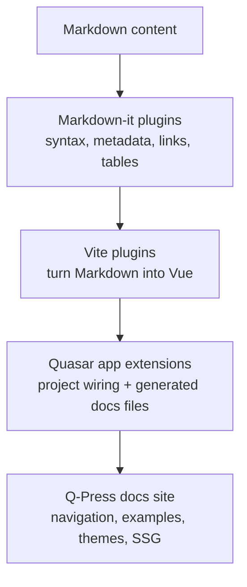

Welcome to the Markdown Plugins documentation! This guide will help you start using Markdown Plugins to enhance your documentation and content creation experience.

## What are Markdown Plugins?

Markdown Plugins are a set of tools and extensions designed to enhance the functionality of Markdown. They provide additional features and capabilities that go beyond the standard Markdown syntax, allowing you to create more dynamic and interactive content.

The core Markdown-it plugins and direct Vite plugins work in Vue/Vite projects as well as Quasar projects. Use the Quasar app extensions when you want Quasar CLI integration, generated Q-Press docs files, and Quasar-specific routing/build configuration.

## Key Features

- **Extended Syntax**: Add custom syntax and elements to your Markdown documents.
- **Custom Containers**: Use custom containers for callouts, warnings, and more.
- **Frontmatter Support**: Extract and process frontmatter content from your Markdown files.
- **Header Management**: Extract and process headers for generating ToCs or managing headers.
- **Inline Code Styling**: Add custom classes to inline code blocks for styling.
- **Link Customization**: Convert Markdown links into Vue components for SPA-friendly routing.
- **Table Enhancements**: Add custom classes and attributes to Markdown tables.
- **Title Extraction**: Extract the first header in Markdown as the page title.
- **Script Imports**: Extract and process **&lt;script import&gt;** blocks from Markdown.
- **Code Block Enhancements**: Enhance code block rendering with syntax highlighting, tabs, and more.
- **Mermaid Diagrams**: Render Mermaid fenced code blocks as client-side diagrams.
- **Custom Styling**: Apply custom styles to your Markdown content for a more refined look.
- **Integration**: Easily integrate with other tools and platforms to streamline your workflow.

## Why Use Markdown Plugins?

Markdown Plugins offer several benefits that make them a valuable addition to your documentation toolkit:

- **Enhanced Readability**: Improve the readability and presentation of your content with custom elements and styles.
- **Increased Productivity**: Save time by using pre-built components and extensions that simplify complex tasks.
- **Better Collaboration**: Facilitate collaboration by providing a consistent and standardized way to create and share content.

## Getting Started

To get started with Markdown Plugins, follow these steps:

1. **Installation**: Cherry-pick and install the Markdown Plugins packages using your preferred package manager.
2. **Configuration**: Configure the plugins to suit your needs and preferences.
3. **Usage**: Start using the plugins in your Markdown documents to enhance your content.

For detailed instructions on installation and configuration, refer to the **Installation** and **Configuration** sections for each respective plugin.

## Examples

Here are some examples of what you can achieve with Markdown Plugins:

- **Custom Syntax**: Add custom syntax for specific use cases.
- **Enhanced Components**: Embed interactive and enhanced components.
- **Custom Styling**: Apply custom styles to your content for a refined look.
- **Frontmatter Support**: Extract and process frontmatter content from your Markdown files.
- **Header Management**: Extract and process headers for generating ToCs or managing headers.
- **Inline Code Styling**: Add custom classes to inline code blocks for styling.
- **Link Customization**: Convert Markdown links into Vue components for SPA-friendly routing.
- **Table Enhancements**: Add custom classes and attributes to Markdown tables.
- **Title Extraction**: Extract the first header in Markdown as the page title.
- **Script Imports**: Extract and process `<script import>` blocks from Markdown.
- **Code Block Enhancements**: Enhance code block rendering with syntax highlighting, tabs, and more.
- **Mermaid Diagrams**: Add flowcharts, sequence diagrams, and other Mermaid diagrams to Markdown pages.

## Support

If you have any questions or need assistance, please refer to the [FAQ](/other/faq) or reach out to our support team.

Happy coding!
