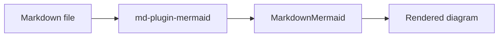

The Mermaid plugin turns `mermaid` and `mmd` fenced code blocks into diagrams. In Q-Press and `viteMdPlugin`, Mermaid diagrams render through the generated `MarkdownMermaid` Vue component so diagrams stay client-side and SSR-safe.

## Example



## Markdown

````markdown

````

## Installation

You can install the Mermaid plugin using npm, yarn, pnpm, or bun:

```tabs
<<| bash pnpm |>>
pnpm add @md-plugins/md-plugin-mermaid mermaid
<<| bash bun |>>
bun add @md-plugins/md-plugin-mermaid mermaid
<<| bash yarn |>>
yarn add @md-plugins/md-plugin-mermaid mermaid
<<| bash npm |>>
npm install @md-plugins/md-plugin-mermaid mermaid
```

Q-Press installs `mermaid` for generated documentation projects. Direct MarkdownIt users only need `mermaid` if they render diagrams in the browser.

## Basic Usage

```ts
import MarkdownIt from 'markdown-it'
import { mermaidPlugin } from '@md-plugins/md-plugin-mermaid'

const md = new MarkdownIt()
md.use(mermaidPlugin)
```

The default output is a Vue component:

```html
<MarkdownMermaid :code="diagramSource"></MarkdownMermaid>
```

If you own the browser initialization yourself, use plain pre mode:

```ts
md.use(mermaidPlugin, {
  renderMode: 'pre',
})
```

That renders Mermaid-compatible HTML:

```html
<pre class="mermaid"><code>flowchart LR...</code></pre>
```
