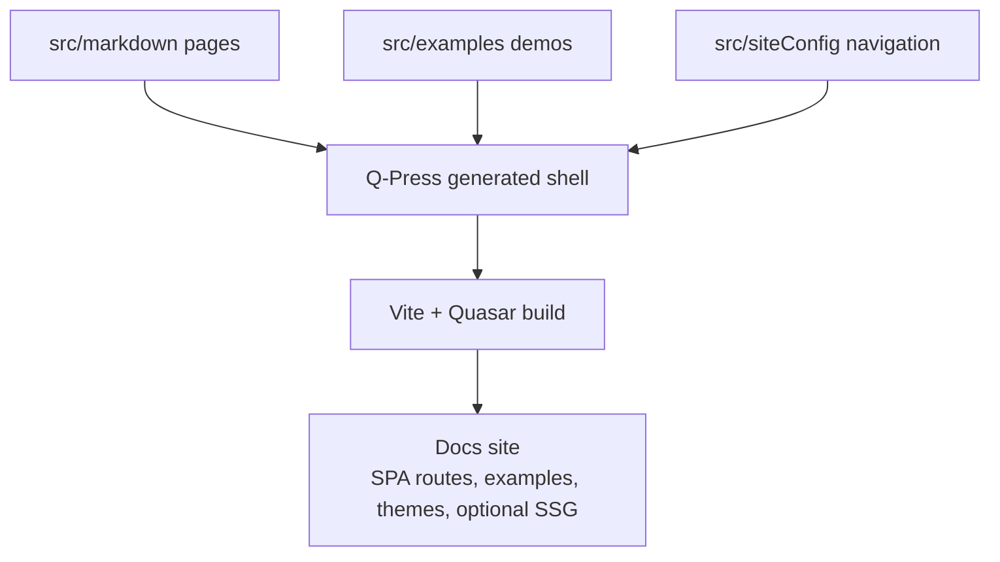

The Q-Press App Extension is a powerful tool for Quasar developers that simplifies the integration of Markdown content into Quasar applications. It leverages the capabilities of Vite and various Markdown plugins to transform Markdown files into Vue components, enabling a seamless and efficient workflow for content management.

::: warning
Q-Press is for Quasar Vite projects using `@quasar/app-vite` `>=3.0.0-beta.40` at this time. TypeScript processing is also required. Do not use if you are using Webpack or have a JavaScript-only project.
:::

::: tip
This website is built with **Q-Press**! When you install the App Extension, you will be able to have this website up and running in minutes. Later, you can make adjustments to the `src/siteConfig` and add your own Markdown files in the `src/markdown` folder to make it your own.
:::

## Key Features

- **Markdown as Vue Components**: Transform Markdown files into Vue components, allowing you to write and manage content in Markdown while leveraging the power of Vue and Quasar.
- **Automatic Configuration**: Automatically configures your Quasar project to handle Markdown files, reducing the need for manual setup.
- **Seamless Integration**: Integrates with Quasar's build system and Vue Router, ensuring smooth navigation and rendering of Markdown content.
- **Customizable**: Provides options to customize the integration, allowing you to tailor the behavior to your specific needs.
- **Hot Module Replacement (HMR)**: Supports HMR for Markdown files, enabling a smooth development experience with instant updates.
- **Static Route Output**: Adds Q-Press SSG route inventory and generated app-factory helpers for static-host prerender workflows.



## How You Work With Q-Press

Q-Press has two kinds of files:

- **Project-owned files** are the files you normally edit: `src/markdown`, `src/examples`, `src/components`, and `src/siteConfig`.
- **Generated shell files** live in `src/.q-press`. They provide the layout, markdown components, composables, API helpers, styles, SSG helpers, and generated route utilities.

The normal authoring loop looks like this:

1. Add or edit Markdown in `src/markdown`.
2. Add the page to `src/siteConfig` if it should appear in the header, sidebar, footer, or `More` menu.
3. Add examples under `src/examples/<topic>` when a page needs live example cards.
4. Use Q-Press components such as `MarkdownExample`, `MarkdownApi`, `MarkdownPage`, and `MarkdownCardLink` inside Markdown when the page needs richer structure.
5. Customize the docs theme through `src/css/quasar.variables.scss` and runtime `--qpress-*` CSS variables.
6. Build with `pnpm build` for SPA output or `pnpm build:ssg` when you want static route HTML for crawlers and static hosts.

When upgrading Q-Press, expect `src/.q-press` to be refreshed. Avoid placing project-specific edits there unless you are intentionally carrying a local fork of the generated shell.

## Route And Content Conventions

Markdown files become route components. The route path follows the file path under `src/markdown`.

```txt
src/markdown/getting-started/introduction.md
  -> /getting-started/introduction

src/markdown/quasar-app-extensions/qpress/themes.md
  -> /quasar-app-extensions/qpress/themes
```

If the folder name and file name are the same, the generated route removes the repeated segment:

```txt
src/markdown/vite-plugins/vite-md-plugin/vite-md-plugin.md
  -> /vite-plugins/vite-md-plugin
```

The landing page is the special case. A `landing-page.md` route is mounted at `/` and usually uses `meta: { fullscreen: true }` so it can own the full hero layout.

## Installation

To install the Q-Press App Extension, use the following command on your existing Quasar project:

```bash
quasar ext add @md-plugins/q-press
```

### What Gets Installed

- **New Install:**
  - `src/.q-press`
  - `src/components`
  - `src/markdown`
  - `src/examples`
  - `src/siteConfig`
- **Update Install:**
  - `src/.q-press`

### Additional Dependencies

1. **Install `markdown-it` and `@types/markdown-it` in your project devDependencies:**

```tabs
<<| bash pnpm |>>
pnpm i -D markdown-it @types/markdown-it
<<| bash bun |>>
bun add -d markdown-it @types/markdown-it
<<| bash yarn |>>
yarn add -D markdown-it @types/markdown-it
<<| bash npm |>>
npm i -D markdown-it @types/markdown-it
```

2. **Q-Press adds `mermaid`, `shiki`, `@md-plugins/vite-ssg-plugin`, and `@vue/server-renderer` to your project dependencies when invoked. If you are wiring the generated files manually, add them yourself:**

```tabs
<<| bash pnpm |>>
pnpm add mermaid shiki @md-plugins/vite-ssg-plugin @vue/server-renderer
<<| bash bun |>>
bun add mermaid shiki @md-plugins/vite-ssg-plugin @vue/server-renderer
<<| bash yarn |>>
yarn add mermaid shiki @md-plugins/vite-ssg-plugin @vue/server-renderer
<<| bash npm |>>
npm i mermaid shiki @md-plugins/vite-ssg-plugin @vue/server-renderer
```

## Configuration

### Verify `tsconfig.json`

Quasar CLI Vite 3 already generates a `tsconfig.json` with JSON module support. If you are migrating an older app, run `quasar prepare` after upgrading so the generated TypeScript config is refreshed.

### Modify `src/css/quasar.variables.scss`

Import a Q-Press theme (`default`, `sunrise`, `newspaper`, `tawny`, `mystic`, your own or a 3rd-party theme):

```scss
@import '../.q-press/css/themes/sunrise.scss';
```

### Modify `src/css/app.scss`

Import Q-Press styles:

```scss
@import '../.q-press/css/app.scss';
```

### Modify `quasar.config.ts`

```ts [maxheight=400px]
import { defineConfig } from '@quasar/app-vite'
import type { Plugin } from 'vite'
import { viteMdPlugin, type MenuItem, type MarkdownOptions } from '@md-plugins/vite-md-plugin'

export default defineConfig(async (ctx) => {
  // Dynamically import siteConfig
  const siteConfig = await import('./src/siteConfig')
  const { sidebar } = siteConfig.default

  return {
    build: {
      vitePlugins: [
        // add this plugin
        [
          viteMdPlugin,
          {
            path: ctx.appPaths.srcDir + '/markdown',
            menu: sidebar as MenuItem[],
            // options: myOptions as MarkdownOptions
          },
        ],
        // other plugins...
      ],
    },
  }
})
```

### Modify `src/routes/routes.ts`

```ts [maxheight=400px]
import type { RouteRecordRaw } from 'vue-router'
import mdPageList from '@/markdown/listing'

const routes = [
  {
    path: '/',
    component: () => import('@/.q-press/layouts/MarkdownLayout.vue'),
    children: [
      // Include the Landing Page route first
      ...Object.entries(mdPageList)
        .filter(([key]) => key.includes('landing-page.md'))
        .map(([, component]) => ({
          path: '',
          name: 'Landing Page',
          component,
          meta: { fullscreen: true, dark: true },
        })),

      // Now include all other routes, excluding the landing-page
      ...Object.keys(mdPageList)
        .filter((key) => !key.includes('landing-page.md')) // Exclude duplicates
        .map((key) => {
          const acc = {
            path: '',
            component: mdPageList[key],
          }

          if (acc.path === '') {
            // Remove '.md' from the end of the filename
            const parts = key.substring(1, key.length - 3).split('/')
            const len = parts.length
            const path = parts[len - 2] === parts[len - 1] ? parts.slice(0, len - 1) : parts

            acc.path = path.join('/')
          }

          return acc
        }),
    ],
  },

  // Always leave this as last one,
  // but you can also remove it
  {
    path: '/:catchAll(.*)*',
    component: () => import('@/pages/ErrorNotFound.vue'),
  },
] as RouteRecordRaw[]

export default routes
```

### Set Up for Dark Mode

Update your `App.vue`:

```ts
<template>
  <router-view />
</template>

<script setup lang="ts">
  import { useDark } from '@/.q-press/composables/dark'
  const { initDark } = useDark()
  initDark()
</script>
```

### Set Up for Meta Tags

This is optional, but it's recommended to set up meta tags for SEO and social media sharing, and especially for SSR.

Update your `App.vue`:

```ts
<template>
  <router-view />
</template>

<script setup lang="ts">
// don't forget to add the Quasar 'Meta' plugin into your quasar.config file!
import { useMeta } from 'quasar'
import getMeta from '@/.q-press/assets/get-meta'

// You can use the `getMeta` function to get the meta tags for your page and provide default values
useMeta({
  title: 'MD-Plugins for Vite, Vue, and Quasar',
  titleTemplate: (title) => `${title} | MD-Plugins`,

  meta: getMeta(
    'MD-Plugins - Markdown tooling for Vite, Vue, and Quasar',
    'MD-Plugins provides Markdown-it plugins, Vite plugins, and Quasar app extensions for Vue/Vite content workflows, Q-Press docs sites, and SSG-ready documentation.',
  ),
})
</script>
```

### Static Route and SSG Output

Q-Press installs the Vite SSG route plugin automatically. During a production SPA build, it emits a `q-press-ssg-routes.json` manifest and route-specific HTML shell files for Markdown routes.

Installed projects also get first-class SSG scripts:

```bash
pnpm build:ssg
pnpm prerender:ssg
```

`build:ssg` rebuilds the SPA output and runs `qpress-ssg` against `dist/spa`. The default Q-Press renderer uses the generated `src/.q-press/ssg/create-app.ts` app factory, so it does not require Quasar SSR mode. `prerender:ssg` reruns only the static prerender pass against existing SPA build output.

```bash
qpress-ssg --out-dir dist/spa
```

Projects that already have Quasar SSR mode enabled can opt into the SSR-bundle renderer with `qpress-ssg --renderer quasar-ssr --ssr-dir dist/ssr`. In both cases, the generated pages still deploy as static files from `dist/spa`, which keeps Netlify and other static-host workflows simple.

### How Q-Press SSG Is Served

Q-Press SSG is a static first-hit workflow. A direct request, browser refresh, or crawler visit to a
known docs route can receive that route's generated `index.html` file instead of only the root SPA
shell.

```txt
/other/upgrade-guide
  -> dist/spa/other/upgrade-guide/index.html
```

That route file includes the prerendered page HTML, route-specific meta tags, and initial client
state. The Vue/Quasar bundle then hydrates the page and takes over interactivity. After hydration,
clicking docs links usually uses Vue Router SPA navigation, so the browser fetches route chunks
instead of requesting each route's `index.html` file again.

This is why SSG can be useful even though the client app still ships: the first response is more
complete, while the hydrated app still keeps fast client-side navigation.

SSG can help SEO and indexing because crawlers, link preview bots, and users receive route-specific
content and metadata in the initial HTML response. It does not guarantee better search ranking by
itself, but it makes docs pages easier for crawlers to read without depending on JavaScript
rendering.

## FAQ

:::details Q. I upgraded an existing Q-Press project and now the browser says `process is not defined`. What changed?

**A.** Q-Press `0.1.0-beta` targets Quasar CLI Vite 3, so browser-side code must use `import.meta.env` instead of `process.env`.

If you copied older Q-Press internals into your app, update the common cases below:

```ts
process.env.CLIENT // old
import.meta.env.QUASAR_CLIENT // new

process.env.DEV // old
import.meta.env.DEV // new

process.env.FS_QUASAR_FOLDER // old
import.meta.env.QCLI_FS_QUASAR_FOLDER // new

process.env.SEARCH_INDEX // old
import.meta.env.QCLI_SEARCH_INDEX // new
```

If your project was generated from an older Q-Press version, rerun the extension update after upgrading:

```bash
quasar ext invoke @md-plugins/q-press
```

Choose `Overwrite All` if you want the generated `src/.q-press` files to match the current beta templates.
:::

:::details Q. I have errors in my `routes.ts` file, what should I do?

**A.** You can remove the following line: `import type { RouteRecordRaw } from 'vue-router'` and also remove the `type` keyword from the `routes` variable (`: RouteRecordRaw[]`).
:::

:::details Q. I see linting issues regarding `any`, what should I do?

**A.** Prefer replacing `any` with the real type first. If the `any` is intentional, keep the exception close to the code and use an oxlint directive with a short explanation:

```ts
// oxlint-disable-next-line typescript/no-explicit-any -- third-party API has no useful type here
function normalizeExternalValue(value: any) {
  return value
}
```

:::

:::details Q. Every time I save a Markdown file, the formatter changes syntax that Q-Press needs. How can I prevent this?

**A.** Current Q-Press projects use `oxfmt` for repository formatting. Use `pnpm format` and `pnpm format:check` as the source of truth for Markdown formatting.

If your editor formats Markdown differently on save, configure it to use the workspace formatter or disable format-on-save for Markdown in that project. A project-level VS Code setting is usually enough:

```json
{
  "[markdown]": {
    "editor.formatOnSave": false
  }
}
```

:::

## Updating

When you update, only the `src/.q-press` folder will be updated. If you want to re-install everything, just remove the `src/siteConfig` folder.

To make it easier to update, you can use the following command:

```bash
quasar ext invoke @md-plugins/q-press
```

Then select the `Overwrite All` option.

---

After invocation, review the refreshed `src/.q-press` folder and keep project-specific docs, examples, theme overrides, and navigation in the project-owned folders described above.
