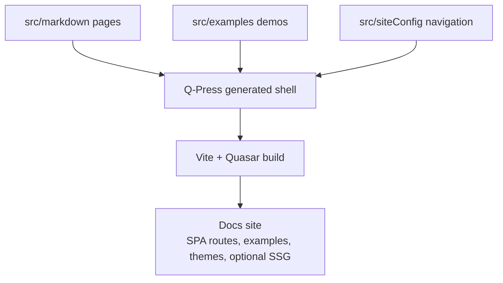

Q-Press is a Quasar App Extension for building documentation sites from Markdown, Vue examples, generated API JSON, search indexes, and an optional static-site prerender pass.

::: warning
Q-Press is for Quasar Vite projects using `@quasar/app-vite` `>=3.0.0` at this time. TypeScript processing is also required. Do not use it with Webpack or JavaScript-only projects.
:::

::: tip
This website is built with **Q-Press**. A new install gives you a working docs site, then you edit `src/siteConfig`, add Markdown pages in `src/markdown`, and add live examples in `src/examples`.
:::

## What Q-Press Provides

- Markdown pages rendered as Vue route components.
- A generated docs shell with header, sidebar, table of contents, footer, dark mode, and theme support.
- Live example cards from Vue files in `src/examples`.
- API pages from Quasar-style JSON, including generated API JSON from TypeScript/JSDoc.
- Search UI backed by a static search index.
- Optional announcement banners, privacy consent, and restrained campaign dialogs.
- Optional SSG output for route-specific static HTML on static hosts.



## Project-Owned Files

Q-Press has two kinds of files:

- **Project-owned files** are the files you normally edit: `src/markdown`, `src/examples`, `src/components`, `src/siteConfig`, `src/css`, and your normal router files.
- **Generated shell files** live in `src/.q-press`. They provide the layout, Markdown components, composables, API helpers, styles, SSG helpers, and generated route utilities.

When upgrading Q-Press, expect `src/.q-press` to be refreshed. Keep project-specific docs, examples, theme overrides, and navigation in project-owned folders.

<MarkdownTree :def="scope.qpressTree" />

## Authoring Loop

1. Add or edit Markdown in `src/markdown`.
2. Add the page to `src/siteConfig` if it should appear in the header, sidebar, footer, or `More` menu.
3. Add Vue examples under `src/examples/<topic>` when a page needs live example cards.
4. Use Q-Press components such as `MarkdownExample`, `MarkdownApi`, `MarkdownPage`, and `MarkdownCardLink` inside Markdown when the page needs richer structure.
5. Customize the theme through `src/css/quasar.variables.scss` and runtime `--qpress-*` CSS variables.
6. Run `pnpm check:qpress` before release.
7. Build with `pnpm build` for SPA output or `pnpm build:ssg` for static route HTML.

## Route Conventions

Markdown files become route components. The route path follows the file path under `src/markdown`.

```txt
src/markdown/getting-started/introduction.md
  -> /getting-started/introduction

src/markdown/quasar-app-extensions/qpress/themes.md
  -> /quasar-app-extensions/qpress/themes
```

If the folder name and file name are the same, the generated route removes the repeated segment:

```txt
src/markdown/vite-plugins/vite-md-plugin/vite-md-plugin.md
  -> /vite-plugins/vite-md-plugin
```

The landing page is the special case. A `landing-page.md` route is mounted at `/` and usually uses `meta: { fullscreen: true }` so it can own the full hero layout. See [Customizing The Landing Page](/quasar-app-extensions/qpress/landing-page) for the focused guide.

## Generated Route Manifest

Q-Press builds a route manifest from `src/markdown/listing.ts` during dev and build. The listing uses Vite's `import.meta.glob()` so Markdown files stay lazy-loaded, HMR-aware, and visible to the bundler.

Each manifest entry contains the source file, generated route path, route name, Markdown component loader, and Q-Press route metadata. `installQPressRoutes()` registers those entries with Vue Router by calling `router.addRoute()` under the generated Q-Press layout route.

Keep custom Vue routes, such as tools, theme builders, or pages with their own layout, in `src/router/routes.ts` as normal route records.

## Where To Go Next

| Page                                                                   | Use it for                                                                                             |
| ---------------------------------------------------------------------- | ------------------------------------------------------------------------------------------------------ |
| [Quick Start](/quasar-app-extensions/qpress/quick-start)               | The shortest path from install to a working docs page.                                                 |
| [Installation](/quasar-app-extensions/qpress/installation)             | Required dependencies, app wiring, router setup, dark mode, and updates.                               |
| [Site Config](/quasar-app-extensions/qpress/site-config)               | Identity, layout switches, public URLs, footer links, and global feature config.                       |
| [Navigation](/quasar-app-extensions/qpress/navigation)                 | Header menus, sidebars, footer links, route paths, and responsive overflow.                            |
| [Landing Page](/quasar-app-extensions/qpress/landing-page)             | Customizing the `/` route with project-owned Markdown, Vue components, assets, and theme styles.       |
| [Markdown Features](/quasar-app-extensions/qpress/markdown-features)   | Q-Press-flavored Markdown helpers such as tabs, callouts, file trees, examples, cards, and API blocks. |
| [Search](/quasar-app-extensions/qpress/search)                         | Static search indexing and the generated search UI.                                                    |
| [Banners + Campaigns](/quasar-app-extensions/qpress/banners-campaigns) | Announcements and restrained opt-in campaign dialogs.                                                  |
| [Privacy Consent](/quasar-app-extensions/qpress/privacy-consent)       | Static-host-friendly privacy notice and consent prompts.                                               |
| [API JSON](/quasar-app-extensions/qpress/api-json)                     | Generated API JSON from TypeScript and JSDoc.                                                          |
| [SSG](/quasar-app-extensions/qpress/ssg)                               | Static route prerendering.                                                                             |
