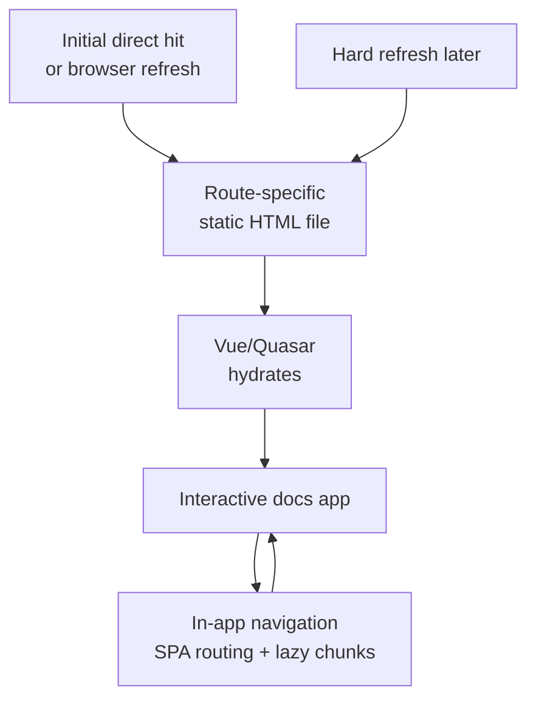

Q-Press includes a static site generation workflow for documentation sites that need route-specific HTML, crawler-friendly metadata, and static-host deployment.

The important framing is this: Q-Press SSG is not a runtime server. It generates static files during the build, serves those files from Netlify or another static host, then lets the Vue/Quasar app hydrate and behave like a normal SPA.

## Why Use SSG

SSG helps docs sites because the first response can already contain the page content for the requested route.

This is useful for:

- Users opening a deep link directly.
- Browser refreshes on docs routes.
- Link-preview bots reading Open Graph and Twitter metadata.
- Search crawlers indexing route-specific content.
- Static hosting where runtime SSR is not available.

SSG does not guarantee better ranking by itself, but it gives crawlers and preview bots meaningful HTML without requiring them to execute the whole client app first.

## How It Works

The practical lifecycle is:



A direct request to a known route can receive that route's generated `index.html` file:

```txt
/other/upgrade-guide
  -> dist/spa/other/upgrade-guide/index.html
```

That file includes prerendered page HTML, route-specific meta tags, and initial client state. After hydration, Vue Router handles normal in-app navigation and lazy route chunks just like the SPA build.

## Generated Scripts

Q-Press installs the md-plugins Vite SSG route plugin (`@md-plugins/vite-ssg-plugin`) automatically and adds these scripts to the docs project:

```bash
pnpm build:ssg
pnpm prerender:ssg
pnpm preview:ssg
```

Use `build:ssg` for a full static build:

```bash
pnpm build:ssg
```

Use `prerender:ssg` when the SPA output already exists and you only want to rerun the static prerender pass:

```bash
pnpm prerender:ssg
```

Use `preview:ssg` to serve the generated output locally with a history fallback:

```bash
pnpm preview:ssg
```

For this repository's docs package, run:

```bash
pnpm --dir packages/docs build:ssg
pnpm --dir packages/docs preview:ssg
```

## Output Directory

By default, Q-Press writes static route files into the SPA output folder:

```bash
qpress-ssg --out-dir dist/spa
```

That default keeps Netlify and other static-host deployments simple because the app still publishes one folder.

The output folder is configurable. Q-Press does not require a `dist/ssg` convention:

```bash
qpress-ssg --out-dir path/to/static-output
```

This matters because Quasar may add first-party SSG later. Q-Press keeps its output configurable so projects can avoid conflicting with future Quasar conventions and so lower-level md-plugins users can choose their own static layout.

## No SSR Mode Required

The default Q-Press renderer does not require Quasar SSR mode.

The `qpress-ssg` command reads the SPA route manifest, loads the generated Q-Press app factory from `src/.q-press/ssg/create-app.ts`, renders each route at build time, and writes the prerendered HTML back into the configured output folder.

```bash
qpress-ssg --out-dir dist/spa
```

That gives static-host deployment without running an SSR server in production.

## Optional Quasar SSR Renderer

Projects that already have Quasar SSR mode enabled can reuse that renderer explicitly:

```bash
pnpm build:ssg:renderer
qpress-ssg --renderer quasar-ssr --out-dir dist/spa --ssr-dir dist/ssr
```

This is optional. It exists for users who already maintain SSR wiring and want the prerender step to reuse the SSR bundle.

## Route Discovery

Q-Press starts with the routes emitted by the md-plugins Vite SSG route plugin. Markdown pages are discovered automatically during the production SPA build and written to `q-press-ssg-routes.json`.

The Q-Press runner also merges static routes from `src/router/routes.ts` by default. That lets standalone Vue pages, such as custom docs tools or generated API pages, be prerendered alongside Markdown routes.

Use `--no-router-routes` when a project wants the prerender manifest to include only the routes emitted during the Vite build:

```bash
qpress-ssg --no-router-routes
```

Use `--router-routes-entry` when the router routes live somewhere else:

```bash
qpress-ssg --router-routes-entry src/router/routes.ts
```

## Crawling Linked Routes

When docs pages link to routes that are not already in the manifest, `--crawl-links` can scan rendered internal links and enqueue those pages:

```bash
qpress-ssg --crawl-links
```

Link crawling is opt-in so builds stay deterministic. It only follows safe internal route links and ignores external URLs, hashes, mail links, telephone links, and asset-looking paths.

For larger docs sites, combine crawling with concurrency controls:

```bash
qpress-ssg --crawl-links --concurrency 4 --interval 250
```

## Excluding Routes

Use `--exclude` for private drafts, dev-only pages, search-only routes, or pages that intentionally remain SPA-only:

```bash
qpress-ssg --exclude /drafts/private --exclude /internal/tools
```

The lower-level `@md-plugins/vite-ssg-plugin` APIs also support string and `RegExp` exclusions when building custom SSG tooling.

## Redirects And 404s

By default, Q-Press follows renderer redirects and skips renderer 404s during prerendering.

Use stricter behavior when CI should fail instead:

```bash
qpress-ssg --redirects error --not-found error
```

Supported redirect modes are:

| Mode     | Behavior                                       |
| -------- | ---------------------------------------------- |
| `follow` | Enqueue the redirect target and skip the route. |
| `skip`   | Skip the redirecting route.                    |
| `error`  | Fail the prerender run.                        |

Supported 404 modes are:

| Mode    | Behavior                 |
| ------- | ------------------------ |
| `skip`  | Skip the missing route.  |
| `error` | Fail the prerender run.  |

## Reports

Each run writes `q-press-ssg-report.json` next to the manifest unless reports are disabled:

```bash
qpress-ssg --report-file q-press-ssg-report.json
qpress-ssg --no-report
```

The report lists generated routes, skipped routes, warnings, render timing, and route counts. It is meant for CI, Netlify deploy debugging, and release review.

## Browser-Only Content

SSG renders during a build, not inside a browser. Keep docs examples safe by avoiding direct browser API access during render.

Prefer guarding browser-only work:

```ts
if (typeof window !== 'undefined') {
  // Browser-only setup here.
}
```

For interactive examples, prefer lazy setup after mount:

```ts
import { onMounted } from 'vue'

onMounted(() => {
  // DOM, canvas, resize observer, local storage, or third-party browser widgets.
})
```

This matters for CodePen demos, Mermaid diagrams, TwoSlash hovers, search indexes, dark-mode persistence, and any component that reads browser state.

## Custom Build Tooling

Q-Press keeps lower-level helpers available for custom build flows:

- `src/.q-press/ssg/create-app`: Creates a fresh Vue SSR app for each route, installs Quasar with the Q-Press plugins, resolves the host Pinia store and router, and prepares a Quasar-style `ssrContext`.
- `src/.q-press/ssg/prerender`: Wraps `prerenderVueSsgRoutes()` with the generated Q-Press app factory.

If a project needs to customize the per-route SSR context or Quasar options, use the generated wrapper and pass `createAppOptions`:

```ts
await prerenderQPressSsgRoutes({
  outDir: 'dist/spa',
  createAppOptions(route) {
    return {
      ssrContext: {
        url: route.path,
        req: {
          url: route.path,
          headers: {
            cookie: 'theme=dark',
          },
        },
      },
    }
  },
})
```

For lower-level control outside Q-Press, import `createQPressSsgApp` directly and pass it to `prerenderVueSsgRoutes()` from `@md-plugins/vite-ssg-plugin`.

```ts
import { prerenderVueSsgRoutes } from '@md-plugins/vite-ssg-plugin'
import { createQPressSsgApp } from './src/.q-press/ssg/create-app'

await prerenderVueSsgRoutes({
  outDir: 'dist/spa',
  createApp: createQPressSsgApp,
})
```

The generated factory is intentionally reusable instead of being tied to a single script. Run it from build tooling that understands the docs app's TypeScript, Vue, and alias configuration when the built `qpress-ssg` command is not enough.

## When To Use The Lower-Level Plugin

Use Q-Press SSG when the project is a Q-Press documentation site.

Use [viteSsgPlugin](/vite-plugins/vite-ssg-plugin/overview) directly when the project uses md-plugins outside Q-Press, needs a custom renderer, or is not a Quasar docs app.
