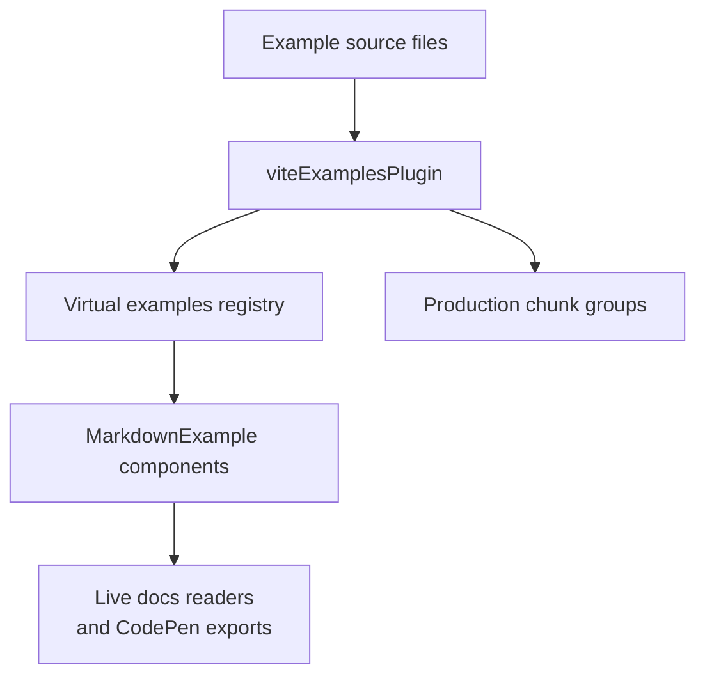

Welcome to the Vite Examples Plugin documentation! This guide will provide you with an overview of the Vite Examples plugins and their features.

## What is the Vite Examples Plugins?

The Vite Examples Plugin is a powerful tool that enhances the standard Vite functionality by providing custom chunking and example file handling. They integrate seamlessly with Vite to provide a flexible and customizable way to manage your Vite build process.

## Key Features

- **Manual Chunking**: Customize the chunking strategy for your Vite build.
- **Example Handling**: Easily include and manage examples in your Vite project.



## Installation

You can install the Vite Examples plugin using npm, yarn, pnpm, or bun. Choose your preferred method below:

```tabs
<<| bash [icon=pnpm] pnpm |>>
pnpm add @md-plugins/vite-examples-plugin
<<| bash [icon=bun] bun |>>
bun add @md-plugins/vite-examples-plugin
<<| bash [icon=yarn] yarn |>>
yarn add @md-plugins/vite-examples-plugin
<<| bash [icon=npm] npm |>>
npm install @md-plugins/vite-examples-plugin
```

## Quasar Configuration

To use the Vite Examples plugin with Quasar, you can extend the Vite configuration as follows:

```typescript
import { viteExamplesPlugin, viteManualChunks } from '@md-plugins/vite-examples-plugin'

extendViteConf(viteConf, { isClient }) {
  if (ctx.prod && isClient) {
    viteConf.build = viteConf.build || {}
    viteConf.build.chunkSizeWarningLimit = 650
    viteConf.build.rolldownOptions = viteConf.build.rolldownOptions || {}
    viteConf.build.rolldownOptions.output = viteConf.build.rolldownOptions.output || {}
    viteConf.build.rolldownOptions.output.codeSplitting = {
      groups: [
        {
          name: (moduleId) => viteManualChunks(moduleId) ?? null,
        },
      ],
    }
  }
}

vitePlugins: [
  viteExamplesPlugin({ isProd: ctx.prod, path: ctx.appPaths.srcDir + '/examples' }),
  // other plugins...
]
```

## Vite Configuration

To use the Vite Examples plugin with Vite, you can configure it as follows:

```typescript
import { defineConfig } from 'vite'
import vue from '@vitejs/plugin-vue'
import { viteExamplesPlugin, viteManualChunks } from '@md-plugins/vite-examples-plugin'

export default defineConfig(({ mode }) => {
  const isProduction = mode === 'production'

  return {
    plugins: [
      vue(),
      viteExamplesPlugin({ isProd: isProduction, path: '/absolute/path/to/examples' }),
    ],
    build: {
      chunkSizeWarningLimit: 650,
      rolldownOptions: {
        output: {
          codeSplitting: {
            groups: [
              {
                name: (moduleId) => viteManualChunks(moduleId) ?? null,
              },
            ],
          },
        },
      },
    },
  }
})
```

## Support

If you have any questions or need assistance, please refer to the FAQ or reach out to our support team.

Happy coding!
