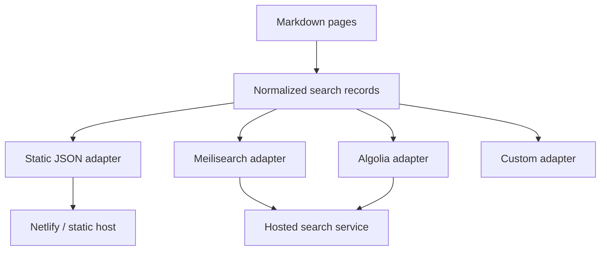

The Vite Search Plugin turns Markdown docs into search records during the Vite build. It is designed
for md-plugins and Q-Press documentation sites that need search data without locking the project
into one search provider.

The plugin produces a normalized search index first, then lets adapters decide how that data should
be emitted. A small docs site can serve the generated JSON directly from Netlify or another static
host. A larger docs site can use the same records as an upload payload for Meilisearch, Algolia, or
a custom search service.

## Why Search Output Is Build-Time

Docs content is usually known at build time. Generating the index during the build gives the search
UI stable data that matches the deployed pages.



The plugin does not require a runtime server. The default JSON adapter works on static hosting by
fetching the generated asset from the browser. Hosted services still need their own runtime search
API, but the md-plugins build can produce the upload-ready data.

## Key Features

- **Markdown discovery**: Scan one or more Markdown roots with Q-Press-style route conventions.
- **Static-host friendly**: Emit `search/search-index.json` for client-side search without a server.
- **Adapter output**: Emit JSON, Meilisearch-ready records, Algolia-ready records, or custom assets.
- **Virtual module**: Import the generated index from `virtual:md-plugins/search-index`.
- **Frontmatter controls**: Use fields such as `title`, `desc`, `tags`, `keys`, and `search: false`.
- **Provider-neutral**: Keep service upload keys out of the browser and outside the core plugin.

## Installation

```tabs
<<| bash pnpm |>>
pnpm add -D @md-plugins/vite-search-plugin
<<| bash bun |>>
bun add -D @md-plugins/vite-search-plugin
<<| bash yarn |>>
yarn add -D @md-plugins/vite-search-plugin
<<| bash npm |>>
npm install -D @md-plugins/vite-search-plugin
```

## Basic Vite Setup

```ts
import { defineConfig } from 'vite'
import { viteSearchPlugin } from '@md-plugins/vite-search-plugin'

export default defineConfig({
  plugins: [
    viteSearchPlugin({
      markdown: {
        root: './src/markdown',
      },
    }),
  ],
})
```

By default, the build emits:

```txt
dist/
  search/
    search-index.json
```

That file contains a generated timestamp, a record count, and the normalized records:

```ts
interface SearchIndex {
  generatedAt: string
  recordCount: number
  records: SearchRecord[]
}
```

## Static Search

The default JSON adapter is the simplest path for Netlify and other static hosts. A search component
can fetch the generated asset and run a lightweight client-side search over the records.

```ts
const response = await fetch('/search/search-index.json')
const searchIndex = await response.json()

const results = searchIndex.records.filter((record) =>
  `${record.title} ${record.section ?? ''} ${record.content}`
    .toLowerCase()
    .includes(query.toLowerCase()),
)
```

This is enough for smaller docs sites and does not require Meilisearch, Algolia, a server function,
or build-time secrets.

## Hosted Search Output

When a project wants hosted search, add adapters for the target provider:

```ts
import {
  createAlgoliaAdapter,
  createMeilisearchAdapter,
  viteSearchPlugin,
} from '@md-plugins/vite-search-plugin'

export default defineConfig({
  plugins: [
    viteSearchPlugin({
      markdown: {
        root: './src/markdown',
      },
      adapters: [
        'json',
        createMeilisearchAdapter({
          indexUid: 'docs',
          fileName: 'search/meilisearch.json',
        }),
        createAlgoliaAdapter({
          fileName: 'search/algolia.json',
        }),
      ],
    }),
  ],
})
```

The hosted adapters only emit data. They do not upload directly. That separation is intentional:
search service admin keys belong in CI or deploy scripts, not in a client-side Vite bundle.

## Q-Press Routes

Markdown files use the same route convention as Q-Press SSG:

- `landing-page.md` becomes `/`
- `guide/getting-started.md` becomes `/guide/getting-started`
- `guide/guide.md` becomes `/guide`

Use `routeBase` when Markdown pages should be indexed under a route prefix:

```ts
viteSearchPlugin({
  markdown: {
    root: './src/markdown',
    routeBase: '/docs',
  },
})
```

## Frontmatter

The plugin reads common docs frontmatter by default:

```md
---
title: Installation
desc: Install and configure the package.
tags:
  - install
  - vite
---
```

Set `search: false` to exclude a page:

```md
---
title: Private Draft
search: false
---
```

The default field behavior is:

- `title`: page title
- `desc` or `description`: page summary
- `tags`, `keys`, or `keywords`: searchable tags
- `badge` and `overline`: copied metadata
- `search: false`: skip the page

## Virtual Module

Application code can import the generated index:

```ts
import searchIndex, { searchRecords } from 'virtual:md-plugins/search-index'
```

The virtual module is useful when a project wants the search data bundled with application code.
For larger sites, prefer fetching the emitted JSON asset so the search payload can be cached
separately from the app bundle.

## When To Use Each Output

- Use `json` when the site is small or medium-sized and deployed to a static host.
- Use `meilisearch` when the project already has Meilisearch Cloud or a self-hosted Meilisearch
  instance.
- Use `algolia` when the project wants Algolia or DocSearch-style hosted search.
- Use a custom adapter when a project needs Pagefind, a serverless search function, or a private
  search pipeline.
