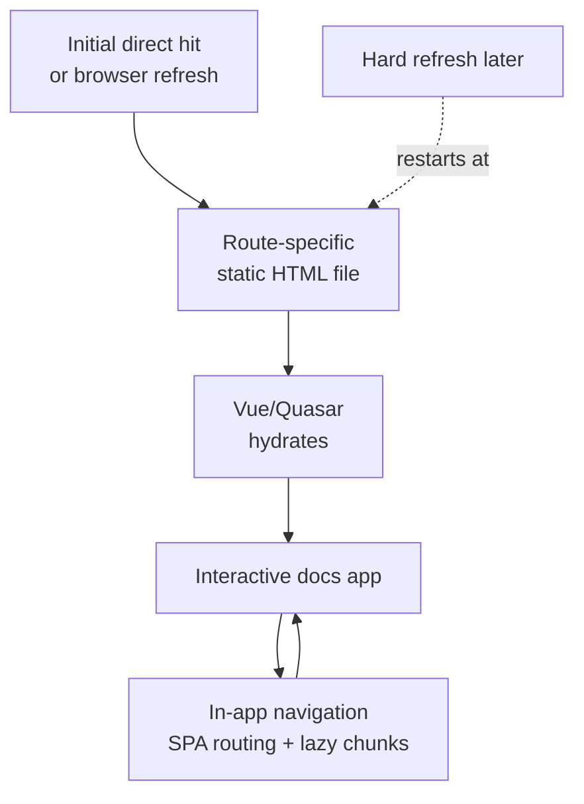

The Vite SSG Plugin gives md-plugins and Q-Press projects a route manifest and static route
output without forcing every docs site to boot as one monolithic SPA for every deep link.

It starts with a safe baseline: inventory the routes, emit `q-press-ssg-routes.json`, and create
route-specific `index.html` files from the built app shell. Projects can stop there for static-host
deep links, or add a renderer when they are ready for full Vue/Quasar HTML prerendering.

## How SSG Works

Static Site Generation is a build-time rendering step. Instead of waiting for the browser to boot a
blank SPA shell and then fetch the route component, the build writes an `index.html` file for each
known route.

For a direct visit or hard refresh, the static host can serve the matching route file:

```txt
/getting-started/introduction
  -> dist/spa/getting-started/introduction/index.html
```

That first response contains real HTML for the route, including page content, route-specific meta
tags, and any initial state that the renderer serializes. After the HTML loads, the normal
Vue/Quasar client bundle hydrates the page. Once hydration is complete, link clicks inside the app
usually use Vue Router client-side navigation, so later navigation behaves like a regular SPA.

The practical lifecycle is:



SSG is not a runtime server. It produces static files that can be deployed to Netlify or any other
static host, while still allowing the app to behave like a SPA after hydration.

## Why Use SSG

Use SSG when a docs site needs static-host deployment but should still serve meaningful HTML for
deep links. It is especially useful for documentation because most routes are known at build time.

- **Static hosting**: Deploy prerendered pages without running a Node SSR server.
- **Deep links**: Refreshing a docs route can return the route's own HTML instead of only the root
  SPA shell.
- **Faster first content**: Browsers receive page markup before the client bundle finishes loading.
- **SEO and indexing**: Crawlers receive route-specific titles, descriptions, headings, and body
  content in the initial HTML response.
- **Social previews**: Link unfurlers and bots that do not execute JavaScript can still read the
  route metadata.
- **SPA behavior preserved**: Once hydrated, menus, drawers, examples, dark mode, and Vue Router
  navigation continue to run on the client.

SSG helps SEO because it reduces the crawler's dependence on JavaScript execution. Modern search
engines such as Google can render JavaScript, but that rendering can be delayed, incomplete, or less
predictable than receiving content in the first HTML response. Many other crawlers and social
preview bots read only the initial HTML. SSG gives those clients route-specific content and meta
tags immediately.

SSG is not a replacement for good content, correct canonical/meta tags, a sitemap, robots policy,
or accessible markup. It simply makes the route content available earlier and more reliably.

## Key Features

- **Route inventory**: Normalize explicit routes or discover Markdown pages from a Q-Press-style
  `src/markdown` folder.
- **Static route files**: Emit `index.html` files for known routes so static hosts can serve deep
  links without depending on a catch-all SPA rewrite.
- **Route payloads**: Inject a small JSON route payload for diagnostics and future hydration
  behavior.
- **Renderer bridge**: Accept a custom renderer or use the Vue/Quasar build-time adapter for
  SSR-quality static HTML.
- **Optional output**: Disable emitted output when a project only wants the virtual manifest or when
  SSG is not enabled for a build.

## Installation

```tabs
<<| bash pnpm |>>
pnpm add @md-plugins/vite-ssg-plugin
<<| bash bun |>>
bun add @md-plugins/vite-ssg-plugin
<<| bash yarn |>>
yarn add @md-plugins/vite-ssg-plugin
<<| bash npm |>>
npm install @md-plugins/vite-ssg-plugin
```

## Basic Vite Setup

Use explicit routes when your app owns the route list:

```ts
import { defineConfig } from 'vite'
import { viteSsgPlugin } from '@md-plugins/vite-ssg-plugin'

export default defineConfig({
  plugins: [
    viteSsgPlugin({
      routes: ['/', '/getting-started/introduction', '/other/releases'],
    }),
  ],
})
```

The build output includes the route manifest plus one static HTML file per route:

```txt
dist/
  index.html
  getting-started/
    introduction/
      index.html
  other/
    releases/
      index.html
  q-press-ssg-routes.json
```

## Markdown Route Discovery

For Q-Press-style docs, let the plugin derive routes from Markdown files:

```ts
import { defineConfig } from 'vite'
import { viteSsgPlugin } from '@md-plugins/vite-ssg-plugin'

export default defineConfig({
  plugins: [
    viteSsgPlugin({
      markdown: {
        root: './src/markdown',
      },
    }),
  ],
})
```

The route discovery is intentionally plain. It maps Markdown files to static routes and can be
combined with explicit route declarations when a site has generated pages, release pages, or other
non-Markdown routes.

## Quasar / Q-Press Setup

In a Quasar docs app, add the plugin to the Vite plugin list used by the client build:

```ts
import { viteSsgPlugin } from '@md-plugins/vite-ssg-plugin'

export default defineConfig((ctx) => ({
  build: {
    vitePlugins: [
      viteSsgPlugin({
        markdown: {
          root: `${ctx.appPaths.srcDir}/markdown`,
        },
      }),
    ],
  },
}))
```

This produces static route files from the normal built shell, which is useful on Netlify and other
static hosts by itself.

## Build-Time Vue Rendering

When a Q-Press project is ready to prerender actual Vue/Quasar HTML, use the generated scripts:

```bash
pnpm build:ssg
pnpm prerender:ssg
```

`build:ssg` runs the normal SPA build and then lets `qpress-ssg` render static HTML from the generated Q-Press SSG app factory. This uses Vue's renderer at build time only and does not require Quasar SSR mode. Projects that already use Quasar SSR can opt into `qpress-ssg --renderer quasar-ssr`.

Projects that need more control can import `createQPressSsgApp` from `src/.q-press/ssg/create-app` and pass it to `prerenderVueSsgRoutes()` directly.

## Optional by Design

SSG output is opt-in at the project level. If a site has runtime SSR enabled, this plugin does not
replace that server. Instead, it can share route inventory and, when desired, run a build-time
prerender pass for selected static routes.

For builds that should not emit SSG assets, pass `enabled: false` or gate the plugin with your own
environment flag.
