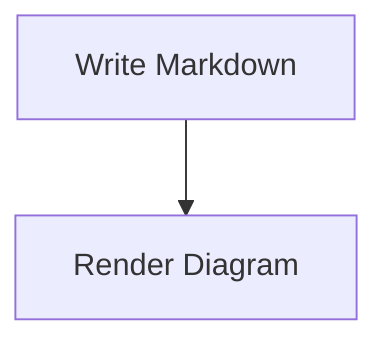

# @md-plugins/md-plugin-mermaid

A **Markdown-It** plugin that renders Mermaid fenced code blocks. It is designed for Q-Press and Vue-based Markdown pages, while still allowing plain MarkdownIt users to render Mermaid-compatible `<pre>` blocks.

## Features

- Converts `mermaid` and `mmd` fenced code blocks into a configurable component.
- Adds page import statements for Q-Press generated Vue pages.
- Supports a plain `<pre class="mermaid">` render mode for custom MarkdownIt pipelines.

## Installation

Install the plugin via your preferred package manager:

```bash
# with pnpm:
pnpm add @md-plugins/md-plugin-mermaid
# with bun:
bun add @md-plugins/md-plugin-mermaid
# with Yarn:
yarn add @md-plugins/md-plugin-mermaid
# with npm:
npm install @md-plugins/md-plugin-mermaid
```

If you render Mermaid in the browser, install Mermaid in the consuming app:

```bash
pnpm add mermaid
```

## Usage

### Q-Press or Vue Component Mode

```ts
import MarkdownIt from 'markdown-it'
import { mermaidPlugin } from '@md-plugins/md-plugin-mermaid'

const md = new MarkdownIt()
md.use(mermaidPlugin, {
  componentName: 'MarkdownMermaid',
})
```

### Raw MarkdownIt Mode

```ts
import MarkdownIt from 'markdown-it'
import { mermaidPlugin } from '@md-plugins/md-plugin-mermaid'

const md = new MarkdownIt()
md.use(mermaidPlugin, {
  renderMode: 'pre',
})
```

Then initialize Mermaid in your application after the HTML is mounted.

## Markdown

````markdown

````

## Options

| Option        | Type                 | Default                  | Description                                     |
| ------------- | -------------------- | ------------------------ | ----------------------------------------------- |
| languages     | string[]             | `['mermaid', 'mmd']`     | Fence languages treated as Mermaid diagrams.    |
| renderMode    | 'component' \| 'pre' | `'component'`            | Output mode for Mermaid diagrams.               |
| componentName | string               | `'MarkdownMermaid'`      | Component used in component mode.               |
| codeProp      | string               | `'code'`                 | Component prop that receives Mermaid source.    |
| preClass      | string               | `'mermaid'`              | CSS class used in pre mode.                     |
| pageScripts   | string[]             | Q-Press component import | Page imports added to generated Vue components. |

## Support

If md-plugin-mermaid is useful in your workflow and you want to support ongoing maintenance:

GitHub Sponsors: https://github.com/sponsors/hawkeye64
PayPal: https://paypal.me/hawkeye64

## License

This project is licensed under the MIT License. See the [LICENSE](LICENSE.md) file for details.
